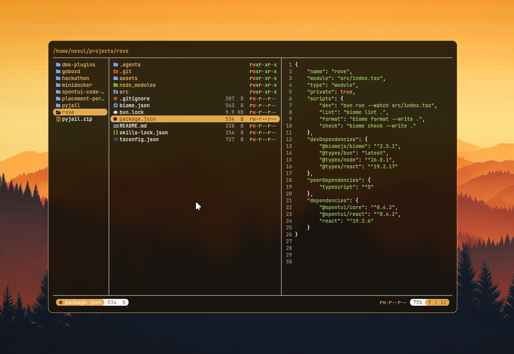

# rove

A fast, keyboard-driven terminal file manager — miller columns, live syntax-highlighted previews, and a UI that paints itself in your terminal's own colors.

Built with [OpenTUI](https://git.new/create-tui) + React, running on [Bun](https://bun.sh).



## What it does

rove gives you the ranger/lf/yazi-style three-pane view: **parent directory** on the left, **current directory** in the middle, **preview** on the right. Move through the tree with the keyboard and the panes shift with you, so you always have context about where you are and what's inside whatever you've got selected.

## Features

- **Miller columns** — parent / current / child layout that follows your cursor as you move.
- **Live file previews** — text files open in the right pane with a line-number gutter; directories show their contents.
- **Image previews** — PNG, JPEG, GIF, BMP and TIFF files render right in the preview pane. rove uses the Kitty graphics protocol for crisp GPU images where the terminal supports it, and falls back to truecolor half-block rendering everywhere else. Images are downscaled to fit the pane (never upscaled).
- **Syntax highlighting** — tree-sitter powered, with **23 languages** bundled out of the box: TypeScript, JavaScript, Markdown, Zig (via OpenTUI) plus Bash, C, C++, C#, CSS, Dart, Elixir, Go, HTML, Java, JSON, Kotlin, Lua, Python, Ruby, Rust, Scala, Swift and TOML. Unrecognized text still previews as plain text.
- **Smart reads** — only the first 128 KB of a file is read for previews, binary files are detected (and skipped) instead of garbling the screen, and tabs are expanded for stable rendering.
- **Filetype icons** — every entry gets a glyph (Nerd Font recommended).
- **Status bar** — selected file's icon, name, human-readable size, colored `rwxr-xr-x` permission bits, symlink indicator, and your scroll position (`TOP` / `BOT` / `42%`).
- **Terminal-native theming** — rove reads your terminal's color palette and *re-reads it live* when your color scheme changes (via DEC mode 2031, with a polling fallback). Switch your terminal from light to dark and rove follows.
- **Toggleable view settings** — flip hidden files, `.gitignore` filtering, the preview pane, the metadata column, and directories-first sorting on the fly with single-key shortcuts.
- **Shortcut overlay** — press `/` for a centered cheat-sheet of every keybinding, with each toggle showing its current on/off state.
- **Mouse scroll** in the preview pane.

## Getting started

Requires [Bun](https://bun.sh) (rove runs on the Bun runtime) and, ideally, a [Nerd Font](https://www.nerdfonts.com/) for the icons.

Install it globally from npm:

```bash
bun install -g rove
# or: npm install -g rove
```

Then launch it anywhere:

```bash
rove            # open the current directory
rove ~/projects # open a specific directory
rove --help     # see all options
```

### Running from source

```bash
bun install
bun dev         # watch mode
bun start       # one-off run
```

rove opens in the directory you pass it, defaulting to the one you launch it from.

## Keybindings

| Key | Action |
| --- | --- |
| `↑` / `k` | Move selection up |
| `↓` / `j` | Move selection down |
| `←` / `h` | Go to parent directory |
| `→` / `l` / `Enter` | Enter directory |
| `/` | Toggle the shortcut overlay |
| `.` | Toggle hidden files |
| `i` | Toggle `.gitignore` filtering |
| `p` | Toggle the file preview pane |
| `m` | Toggle the metadata column |
| `s` | Toggle directories-first sorting |
| `Esc` | Close the shortcut overlay |
| `Ctrl+P` | Toggle the terminal palette inspector |
| `` Ctrl+` `` | Toggle the OpenTUI debug console |
| `Ctrl+C` | Quit |

## Project layout

| File | Responsibility |
| --- | --- |
| `src/cli.ts` | CLI entry — argument parsing (yargs), boots the TUI |
| `src/index.tsx` | App — layout, navigation state, keybindings, `start()` |
| `src/components/file-tree.tsx` | Renders a column of directory entries |
| `src/components/preview.tsx` | File previews, syntax theme, filetype → grammar mapping |
| `src/components/image-preview.tsx` | Image rendering (Kitty protocol + half-block fallback) |
| `src/components/statusbar.tsx` | Bottom status bar |
| `src/components/palette.tsx` | Terminal palette inspector overlay |
| `src/components/shortcuts.tsx` | Keyboard-shortcut help overlay |
| `src/lib/hooks.ts` | `useTerminalColors` — live terminal palette tracking |
| `src/lib/use-settings.ts` | View settings + their toggle keybindings |
| `src/lib/image.ts` | Image decode/scale, protocol detection, Kitty encoding |
| `src/lib/utils.ts` | Directory reads, stat/permission formatting, preview reads |
| `src/lib/icons.ts` | Filetype → icon/color mapping |
| `src/lib/types.ts` | Shared `FileNode` / `FileMeta` types |
| `src/grammars.ts` | Registers the bundled tree-sitter grammars |
| `src/grammars/` | Bundled `grammar.wasm` + `highlights.scm` per language |

## Development

```bash
bun dev        # run with hot reload
bun run lint   # biome lint
bun run format # biome format --write
bun run check  # biome check --write
```

## Tech

[OpenTUI](https://git.new/create-tui) (core + React renderer) · React 19 · Bun · tree-sitter · [Jimp](https://github.com/jimp-dev/jimp) (image decoding) · Biome.

Scaffolded with `bun create tui`.
